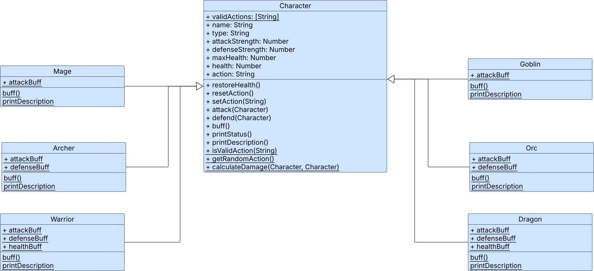

# Dragon Slayer Case Study

**Table of Contents:**

- [Project Overview](#project-overview)
- [Directory Structure](#directory-structure)
- [Purpose of Key Files](#purpose-of-key-files)
- [Learning Objectives](#learning-objectives)
- [Gameplay Overview](#gameplay-overview)
- [Setup \& Running Instructions](#setup--running-instructions)
- [Class Relationships \& Key Interactions](#class-relationships--key-interactions)
  - [Key Interactions](#key-interactions)
- [Additional Resources](#additional-resources)


## Project Overview

Dragon Slayer is a simple, command-line, object-oriented RPG where players choose a hero and battle their way to defeat a dragon, facing multiple enemies along the way. The project is structured to both demonstrate core OOP concepts (like inheritance, polymorphism, and encapsulation) and how to organize code in a modular Node.js application.

## Directory Structure

```
dragon-slayer/
├── src/
│   ├── index.js                  # Entry point: main menu and game loop
│   ├── Game.js                   # Game logic and central manager class
│   ├── makeGameHistoryManager.js # Factory for managing/saving game history
│   ├── utils/
│   │   └── fileIO.js             # File read/write helpers for JSON files
│   ├── characters/
│   │   ├── Character.js          # Base Character class
│   │   ├── Heroes.js             # Mage, Warrior, Archer hero classes
│   │   └── Enemies.js            # Goblin, Orc, Dragon enemy classes
│   └── data/
│       └── gameHistory.json      # (Generated at runtime) Persists history of games
├── README.md                     # This file
├── package.json                  # Node.js dependencies & scripts (if used)
└── ...                           # (other typical git/node files)
```

---

## Purpose of Key Files

- **src/index.js**:  
  Main "launcher" for the game. Handles the menu, user input, and orchestrates creation and saving of game sessions.

- **src/Game.js**:  
  Defines the `Game` class, which manages an individual play session, including the sequence of battles, player/enemy selection, and win/lose logic. Also contains static helpers to print instructions and character stats.

- **src/makeGameHistoryManager.js**:  
  Exports a factory function that creates a history manager object responsible for tracking, displaying, and persisting completed games.

- **src/utils/fileIO.js**:  
  Utility file for reading from and writing to the `gameHistory.json` file using Node's filesystem.

- **src/characters/Character.js**:  
  Defines the abstract base class for all characters (heroes and enemies) with shared properties and methods.

- **src/characters/Heroes.js**:  
  Defines the Mage, Warrior, and Archer hero classes, which inherit from Character and implement their own abilities.

- **src/characters/Enemies.js**:  
  Implements specific enemy classes: Goblin, Orc, and Dragon, each with unique stats and moves.

- **src/data/gameHistory.json**:  
  Stores the saved history of game sessions, written to/loaded from by the game history manager.

---

## Learning Objectives

This case study demonstrates the following Mod 2 OOP concepts:
- **Encapsulation** (with closures via factory functions and with classes)
- **Inheritance** (Character base class with Hero/Enemy subclasses)
- **Polymorphism** (shared interfaces with class-specific implementations)
- **Factory Functions** (makeGameHistoryManager using closures)
- **Static vs Instance Methods** (Game and Character class methods)

For detailed investigation questions exploring these concepts, see [INVESTIGATION.md](./INVESTIGATION.md).

## Gameplay Overview

You are on a quest to slay the dragon.

Choose a hero (Mage, Warrior, or Archer) and battle through three levels:
1. **Level 1**: Fight a Goblin (a fairly easy win)
2. **Level 2**: Fight an Orc (you should win most of the time)
3. **Level 3**: Fight the Dragon (a real challenge!)

Each turn, choose your action:
- **Attack**: Deal damage to the enemy.
- **Defend**: Double your defense and counterattack if all damage is blocked.
- **Buff**: Power up your character (increases attack, defense, or health). You will be vulnerable and take double damage if attacked.

Your enemies are powerful, but they choose their actions randomly and announce their choice before you act. If you want to win you must be strategic with your choices! 

**Tip**: Health is restored between levels, but buffs persist.

---

## Setup & Running Instructions

1. **Install Dependencies**
   - Be sure you have [Node.js](https://nodejs.org/) installed (`v16+` recommended).
   - Run `npm install` if you have dependencies (none strictly required unless you add a dependency to `package.json`). If `prompt-sync` is missing, run:  
     ```sh
     npm install prompt-sync
     ```

2. **Start the Game**
   - From the project root, run:
     ```sh
     node src/index.js
     # or
     npm start
     ```

---

## Class Relationships & Key Interactions

- **Character (Base Class)**  
  All heroes and enemies extend from `Character`, sharing core stats like health, attack, defense, as well as common methods for attacks, buffs, and damage calculation.

- **Heroes (Mage, Warrior, Archer)**  
  Inherit from `Character`. Each implements unique abilities and flavor through constructor params and buff/attack logic.

- **Enemies (Goblin, Orc, Dragon)**  
  Also extend `Character`. They choose actions randomly and scale up in difficulty.

- **Game**  
  Central coordinator. Handles setup, main game loop, battle execution, progression, and printing instructions/stats. Knows the player and current enemy.

- **makeGameHistoryManager**
  A factory that creates a private `gameHistory` manager object, encapsulating methods for:
    - Adding completed games
    - Displaying the history
    - Saving/loading history from filesystem using `fileIO.js`

- **fileIO.js**  
  Has generic utility functions for writing data to / reading from a given file. Used by the game history manager for file persistence for game history so progress is saved between runs.

### Key Interactions

- `index.js` (menu loop) creates a `gameHistoryManager`.
- Each time the player wants to play, a new `Game` instance is created.
- After each session, the new `Game` instance is passed to `gameHistoryManager.addGame`.
- On exit, history is persisted to `src/data/gameHistory.json`.
- The core battle loop is orchestrated by the `Game` class, which uses hero/enemy instances and their overridden attack/buff methods (illustrating polymorphism and encapsulation).

---

## Additional Resources

- **Character UML Diagram**: See `img/character-uml.svg` for a visual representation of class relationships
- **Investigation Guide**: Complete the questions in `INVESTIGATION.md` to deepen your understanding of the OOP patterns used



---

Enjoy the adventure, and good luck slaying the dragon!
